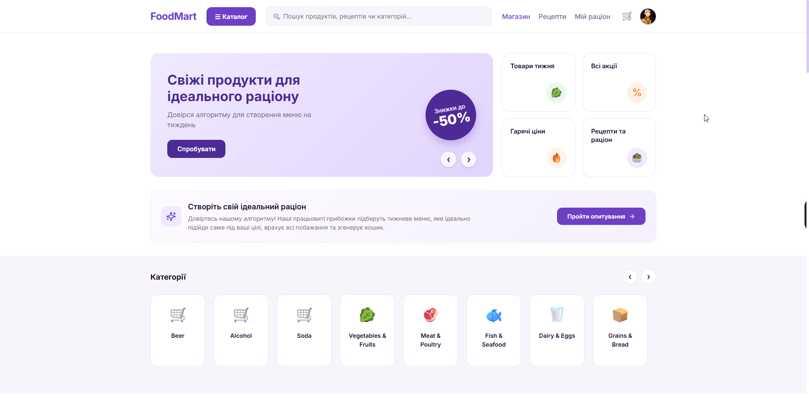
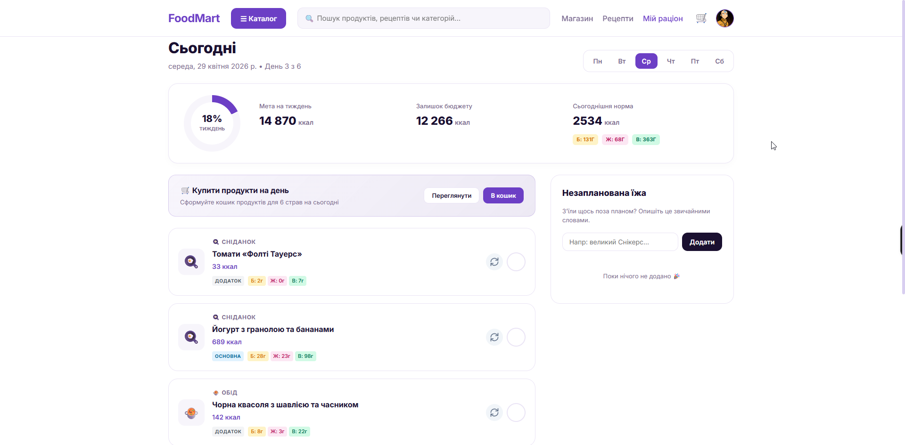
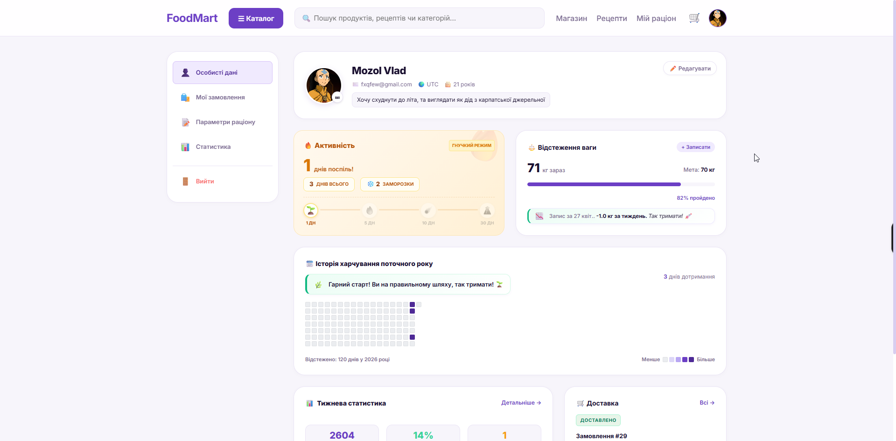
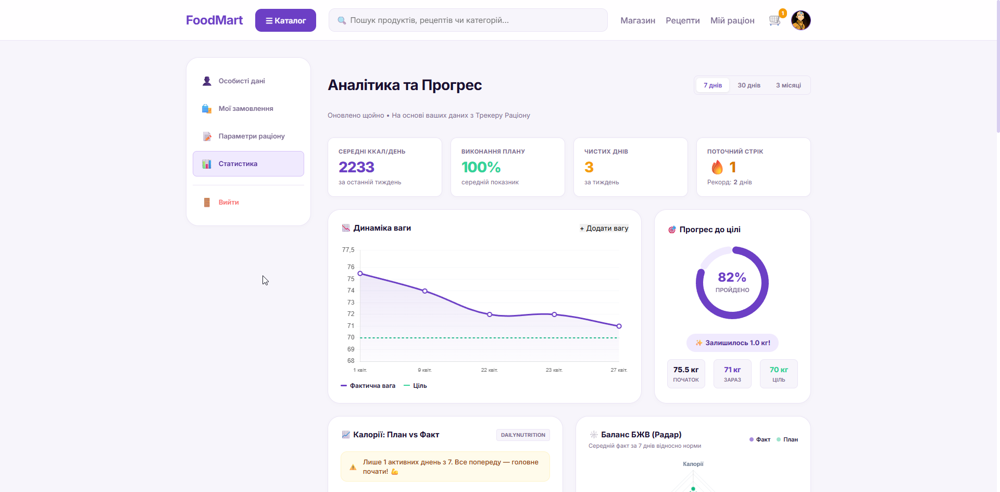
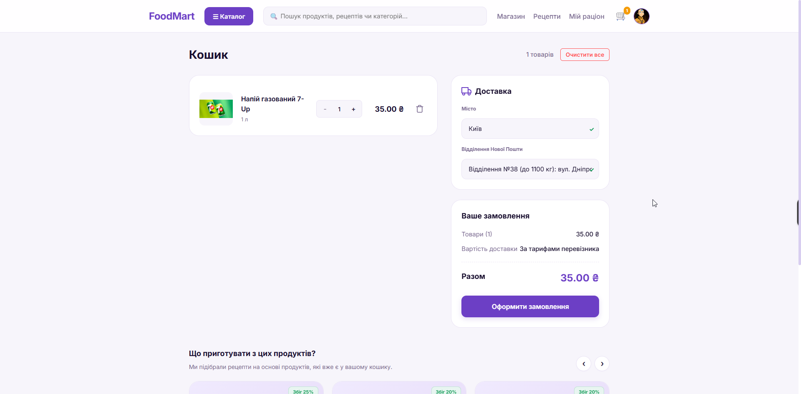
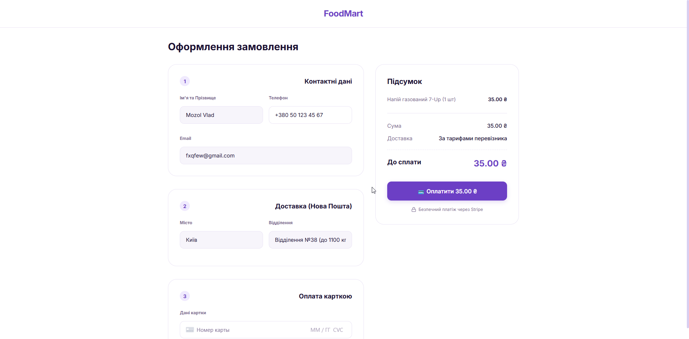
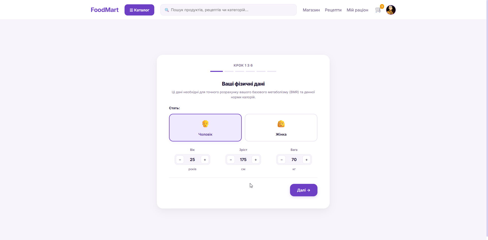

# FoodMart — Meal Planner System

FoodMart is an advanced full-stack platform that **algorithmically generates** personalized weekly meal plans, **intelligently optimizing** a database of **12,000+ recipes** to meet caloric targets, dietary restrictions, and budget constraints. It features an **AI-powered nutrition assistant** for natural language food logging, an **integrated grocery store** with **Stripe payments**, and adaptive daily rebalancing. Built with **Spring Boot 4** and **React 19**, the system automates the entire journey from BMR calculation to **Nova Poshta** integration for warehouse selection.


## ⭐ Key Features

- **Algorithmic Meal Planning** — Generates 7-day plans based on macro-balance, cooking complexity, and budget preferences.
- **Adaptive Rebalancing** — Automatically recalculates caloric budgets if meals are skipped or extra food is logged.
- **AI Nutrition Assistant** — LLM-powered parsing of free-text food entries (e.g., "bowl of oatmeal with honey") into structured data.
- **Grocery E-Commerce** — Integrated store where users can buy recipe ingredients in one click with **Stripe** checkout.
- **Health Dashboards** — Goal tracking, weight dynamics charts, and a GitHub-style nutrition contribution heatmap.
- **Enterprise Security** — JWT-based auth with **Google/GitHub OAuth2** and Azure Blob Storage for media.

## 🚀 Quick Start

1. **Setup Environment**:
   ```bash
   git clone https://github.com/feexq/meal-planner-system.git
   cd meal-planner-system/meal-planner-system
   cp .env.example .env # Fill in your API keys
   ```
2. **Launch Services**:
   ```bash
   docker-compose up -d --build
   ```


## 🛠 Tech Stack
<details>
<summary><b>View detailed technology layers</b></summary>

### ☕ Backend & AI
- **Java 17 / Spring Boot 4** — Core API, Security (JWT/OAuth2), Data JPA
- **Python 3.11 / FastAPI** — NLP microservice for LLM food parsing
- **PostgreSQL 15** — Relational storage with **Liquibase** migrations
- **Redis 7** — Caching layer for LLM responses and sessions

### ⚛️ Frontend & Integration
- **React 19 / Vite** — Modern UI with Chart.js for health analytics
- **Stripe SDK** — Secure payment processing & embedded Elements
- **Azure Blob Storage** — Cloud hosting for user profile pictures
- **Nova Poshta API** — Integrated shipping and warehouse selection

</details>

## 📸 Screenshots
<details>
<summary><b>View application gallery</b></summary>

<p align="center">
  
  
</p>
<p align="center">
  
  
</p>
<p align="center">
  
  
</p>
<p align="center">
  
</p>

</details>
